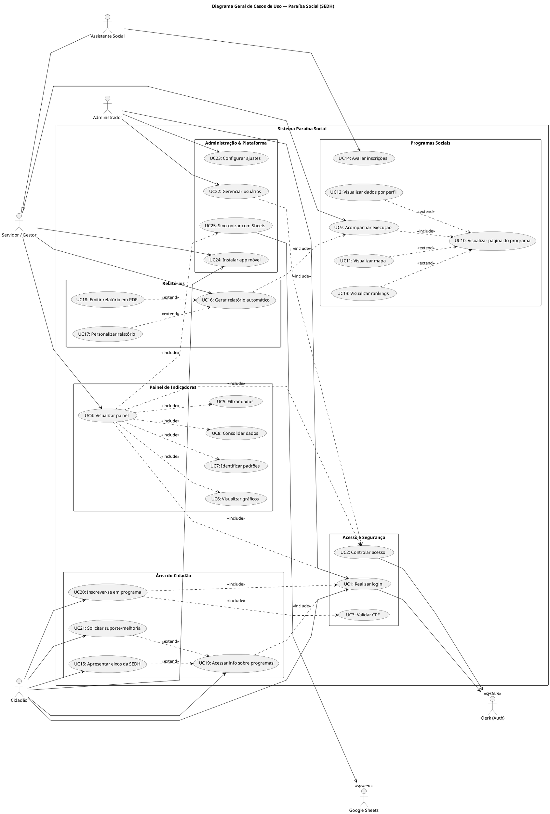

# Análise de Casos de Uso - Paraíba Social (SEDH)

Este documento contém o diagrama geral de casos de uso do sistema Paraíba Social.

## Diagrama Geral

> **Nota:** As especificações textuais detalhadas (ou histórias de usuário) de cada um dos casos de uso representados neste diagrama podem ser encontradas nos demais arquivos markdown desta pasta.
